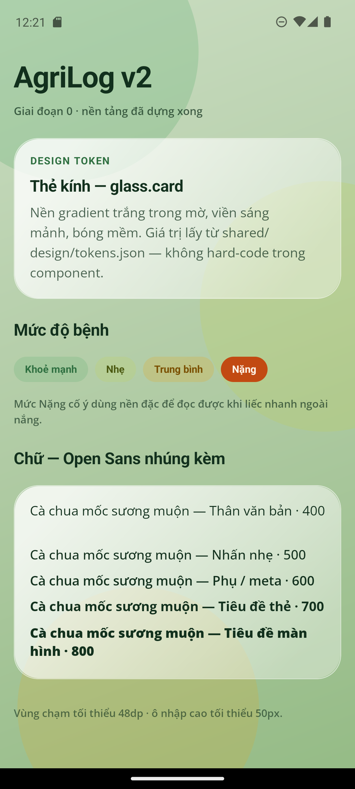

# AgriLog v2

Ứng dụng ghi chú vật tư nông nghiệp cho nông hộ trồng cà chua: nhật ký canh tác, quản lý
lô đất, chẩn đoán bệnh cây qua ảnh, tư vấn phân bón, lịch chăm sóc, quản lý kho vật tư và
ghi thu chi — kèm trang quản trị web cho cán bộ quản lý.

> **Trạng thái: Giai đoạn 0 — đã dựng xong nền tảng.**
> README này sẽ được viết đầy đủ ở Giai đoạn 6. Bản hiện tại chỉ đủ để chạy dự án.



## Mục lục

- [Kiến trúc thư mục](#kiến-trúc-thư-mục)
- [Yêu cầu môi trường](#yêu-cầu-môi-trường)
- [Chạy backend](#chạy-backend)
- [Chạy web-admin](#chạy-web-admin)
- [Chạy mobile](#chạy-mobile)
- [Design token và font](#design-token-và-font)
- [Dữ liệu tĩnh offline](#dữ-liệu-tĩnh-offline)
- [Giới hạn hiện tại](#giới-hạn-hiện-tại)

## Kiến trúc thư mục

| Thư mục | Nội dung |
|---|---|
| `mobile/` | Ứng dụng nông hộ — React Native 0.81 CLI + TypeScript + WatermelonDB. |
| `web-admin/` | Trang quản trị — Next.js 16 App Router + Tailwind CSS 4. |
| `backend/` | API — FastAPI + SQLAlchemy 2 (SQLite khi dev, PostgreSQL khi production). |
| `shared/design/` | `tokens.json` (nguồn sự thật của thiết kế) và các script sinh file theme. |
| `shared/data/` | Dữ liệu tĩnh đọc offline: bệnh cà chua, phân bón, quy trình chăm sóc, giống cây. |
| `docs/design-reference/` | Bản giải nén của file thiết kế gốc để tra cứu khi dựng màn hình. |
| `docs/adr/` | Nhật ký quyết định kiến trúc. |

## Yêu cầu môi trường

- Node.js ≥ 20 (đã kiểm chứng trên 24.18.0), npm ≥ 10
- Python ≥ 3.12
- JDK 17
- Android SDK: platform 36+, build-tools 36+, **NDK 27.1.12297006**, CMake 3.22.1
- Biến môi trường `ANDROID_HOME` trỏ tới thư mục Android SDK

## Chạy backend

```bash
cd backend
python -m venv .venv
./.venv/Scripts/python.exe -m pip install -r requirements.txt   # Windows
# source .venv/bin/activate && pip install -r requirements.txt  # macOS / Linux

cp .env.example .env
./.venv/Scripts/python.exe -m app.seed          # tạo tài khoản demo
./.venv/Scripts/python.exe -m uvicorn app.main:app --reload --port 8000
```

Kiểm tra: <http://127.0.0.1:8000/health> · tài liệu API: <http://127.0.0.1:8000/docs>

Tài khoản demo (đặt trong `.env`, đổi được):

| Tài khoản | Mật khẩu | Vai trò |
|---|---|---|
| `admin` | `admin123` | Quản trị viên |
| `quanghoc` | `matkhau123` | Nông dân |

Chạy test: `./.venv/Scripts/python.exe -m pytest`

## Chạy web-admin

```bash
cd web-admin
npm install
cp .env.example .env.local
npm run dev        # http://localhost:3000
```

Kiểm tra kiểu: `npx tsc --noEmit` · lint: `npm run lint`

## Chạy mobile

```bash
cd mobile
npm install
npx react-native start                    # Metro, để chạy ở một cửa sổ riêng
cd android && ./gradlew app:installDebug  # cài lên máy ảo / thiết bị
```

> **Lưu ý Windows:** `npx react-native run-android` báo lỗi `'gradlew.bat' is not
> recognized` khi chạy từ Git Bash. Dùng `./gradlew app:installDebug` trong `mobile/android`
> như trên (hoặc chạy `run-android` từ PowerShell/CMD).

Cho phép máy ảo gọi Metro và backend trên máy chủ:

```bash
adb reverse tcp:8081 tcp:8081
adb reverse tcp:8000 tcp:8000
```

Kiểm tra kiểu: `npx tsc --noEmit` · lint: `npx eslint App.tsx src`

## Design token và font

`shared/design/tokens.json` là **nguồn sự thật duy nhất** cho màu, font, bo góc, spacing,
hiệu ứng kính — trích từ file thiết kế `AgriXAI Farmer v4 - Standalone (1).html`. Không
hard-code màu trong component.

```bash
node shared/design/build-tokens.js     # -> mobile/src/theme.ts, web-admin/src/app/tokens.css
node shared/design/extract-fonts.js    # -> web-admin/public/fonts/*.woff2 + fonts.css
python shared/design/build-mobile-fonts.py   # -> mobile/src/assets/fonts/*.ttf
node shared/design/extract-design.js <thư-mục-đích>   # giải nén lại file thiết kế gốc
```

Font Open Sans được **nhúng kèm** cả hai nền tảng, không tải từ Google Fonts lúc chạy.

## Dữ liệu tĩnh offline

`shared/data/` chứa bốn danh mục mà ứng dụng phải đọc được khi không có mạng:

| File | Nội dung | Nguồn |
|---|---|---|
| `tomato_diseases.json` | 10 bệnh/đối tượng hại trên cà chua | File thiết kế + kiến thức nông nghiệp phổ thông |
| `fertilizer_recommendations.json` | Danh mục và **giá thật** phân bón | `fertilizers_seed.json` (sfarm.vn, giacaphe.com — 06–07/09/2026) |
| `care_protocols.json` | Lịch bón phân theo giai đoạn cây | `care_protocol_tomato_seed.json` (giongcaytrong.org) |
| `crop_varieties.json` | 8 giống cà chua thật | `crop_varieties_seed.json` (sfarm.vn, nguonsinhthai.com) |

**Giá phân bón trong file chỉ là dữ liệu khởi tạo.** Giá biến động theo ngày và vùng miền,
nên nguồn sự thật khi chạy là bảng `fertilizer_prices` trong backend, sửa được ở màn hình
Admin và có lưu lịch sử giá (Giai đoạn 4). Không hard-code giá ở bất kỳ đâu trong mã nguồn.

## Giới hạn hiện tại

- **Giai đoạn 0** mới chỉ dựng nền tảng: chưa có màn hình nghiệp vụ nào. `App.tsx` và trang
  chủ web-admin hiện là màn hình kiểm tra design token, sẽ bị thay ở Giai đoạn 1 và 4.
- Backend mới có `GET /health`, `POST /auth/login`, `GET/PATCH /auth/me`. Các endpoint còn
  lại theo Mục 7 sẽ bổ sung dần.
- Mô hình chẩn đoán ảnh chưa có — sẽ dùng `DummyPredictor`, thay bằng model thật qua biến
  môi trường `MODEL_CHECKPOINT`.
- Nhận dạng giọng nói chưa có — sẽ dùng `DummyAsrEngine` trước, chọn Vosk hay whisper.cpp
  bằng benchmark ở Giai đoạn 5.
