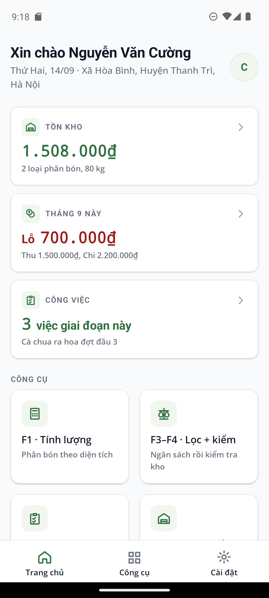

# AgriLog v2

Ứng dụng ghi chép vật tư và chi phí cho nông hộ: quản lý lô đất theo cây trồng và giống,
tư vấn phân bón, lịch chăm sóc, quản lý kho vật tư và ghi thu chi — kèm trang quản trị web
cho cán bộ quản lý.

> **Trạng thái:** Giai đoạn 4 đã xong — dashboard 3 thẻ (tồn kho · lãi/lỗ tháng · việc
> chờ), error boundary theo màn hình + nhật ký lỗi, banner offline / trạng thái đồng bộ,
> xuất báo cáo thu – chi ra PDF (mobile tạo tại chỗ, web tải từ server), ba tài khoản nông hộ
> cô lập dữ liệu và hộp thoại xử lý xung đột khi một tài khoản dùng hai máy, web-admin có
> đăng nhập + dashboard responsive. Xem [ADR 0006](docs/adr/0006-giai-doan-4-dashboard-offline-pdf-da-nguoi-dung.md);
> Giai đoạn 3 ở [ADR 0005](docs/adr/0005-giai-doan-3-tu-van-cham-soc-kho-thu-chi.md).
> README này sẽ được viết đầy đủ ở Giai đoạn 6; bản hiện tại chỉ đủ để chạy dự án.



## Phạm vi

Ứng dụng **không** chẩn đoán bệnh cây. Tính năng đó từng có ở Giai đoạn 2 và đã bị gỡ bỏ
hoàn toàn — lý do và danh sách những gì bị xoá nằm ở
[ADR 0003](docs/adr/0003-thu-hep-pham-vi.md).

Bốn mảng nghiệp vụ của dự án:

| # | Mảng | Trạng thái |
|---|---|---|
| 1 | Tư vấn & phân loại phân bón (F1–F4) | ✅ F1 tính lượng theo diện tích & phương án (lưu kế hoạch) · F3 ba tab ngân sách · F4 kiểm tra kho đủ/thiếu · Danh mục 6 nhóm |
| 2 | Quy trình chăm sóc theo giai đoạn (F5–F6) | ✅ 7 quy trình có nguồn (cà chua, cà phê vối, cà phê chè, dưa leo ×2, ớt cay, ớt ngọt); cà phê mít, Excelsa, ớt kiểng hiện "Chưa có dữ liệu" kèm nguồn tham khảo. Accordion 4 giai đoạn, ô "Đã làm", đặt nhắc |
| 3 | Nhập – Xuất kho | ✅ Nhập (tự ghi khoản chi), xuất giá FIFO, bảng tồn, biểu đồ tồn theo thời gian, lọc tháng/quý, xuất CSV |
| 4 | Thu – Chi | ✅ Ghi thu/chi, đánh dấu đã kiểm tra, báo cáo tháng/quý (lãi/lỗ, thu-chi theo ngày, chi theo loại), xuất CSV |

Nền cho cả bốn mảng: **danh mục giống cây 3 cấp** (loại cây → loại con → giống) với 4 loại
cây · 17 loại con · 40 giống có nguồn — xem [ADR 0004](docs/adr/0004-he-thiet-ke-phang-va-danh-muc-giong-3-cap.md).

Lớp vận hành (Giai đoạn 4): dashboard, error boundary + `POST /logs`, banner offline và
trạng thái đồng bộ theo bảng, PDF báo cáo tháng/quý, đồng bộ nhiều tài khoản với hộp thoại
xung đột, web-admin `/login` → `/dashboard` — xem [ADR 0006](docs/adr/0006-giai-doan-4-dashboard-offline-pdf-da-nguoi-dung.md).

Hệ quả đáng chú ý: app chỉ xin **đúng một quyền** — `INTERNET`. Không còn quyền máy ảnh
hay quyền đọc thư viện ảnh.

## Mục lục

- [Phạm vi](#phạm-vi)
- [Kiến trúc thư mục](#kiến-trúc-thư-mục)
- [Yêu cầu môi trường](#yêu-cầu-môi-trường)
- [Chạy backend](#chạy-backend)
- [Chạy web-admin](#chạy-web-admin)
- [Chạy mobile](#chạy-mobile)
- [Design token và font](#design-token-và-font)
- [Dữ liệu tĩnh offline](#dữ-liệu-tĩnh-offline)
- [Đồng bộ dữ liệu](#đồng-bộ-dữ-liệu)
- [Giới hạn hiện tại](#giới-hạn-hiện-tại)

## Kiến trúc thư mục

| Thư mục | Nội dung |
|---|---|
| `mobile/` | Ứng dụng nông hộ — React Native 0.81 CLI + TypeScript + WatermelonDB. |
| `web-admin/` | Trang quản trị — Next.js 16 App Router + Tailwind CSS 4. |
| `backend/` | API — FastAPI + SQLAlchemy 2 (SQLite khi dev, PostgreSQL khi production). |
| `shared/design/` | `tokens.json` (nguồn sự thật của thiết kế) và các script sinh file theme. |
| `shared/data/` | Dữ liệu tĩnh đọc offline: phân bón, quy trình chăm sóc, giống cây. |
| `docs/design-reference/` | Bản giải nén của file thiết kế gốc để tra cứu khi dựng màn hình. |
| `docs/adr/` | Nhật ký quyết định kiến trúc. |

## Yêu cầu môi trường

- Node.js ≥ 20 (đã kiểm chứng trên 24.18.0), npm ≥ 10
- Python ≥ 3.12
- JDK 17
- Android SDK: platform 36+, build-tools 36+, **NDK 27.1.12297006**, CMake 3.22.1
- Biến môi trường `ANDROID_HOME` trỏ tới thư mục Android SDK

## Chạy backend

```bash
cd backend
python -m venv .venv
./.venv/Scripts/python.exe -m pip install -r requirements.txt   # Windows
# source .venv/bin/activate && pip install -r requirements.txt  # macOS / Linux

cp .env.example .env
./.venv/Scripts/python.exe -m app.seed          # tạo tài khoản demo
./.venv/Scripts/python.exe -m uvicorn app.main:app --reload --port 8000
```

Kiểm tra: <http://127.0.0.1:8000/health> · tài liệu API: <http://127.0.0.1:8000/docs>

Tài khoản demo (đặt trong `.env`, đổi được):

| Tài khoản | Mật khẩu | Vai trò |
|---|---|---|
| `admin` | `admin123` | Quản trị viên |
| `thaitaka` | `matkhau123` | Nông dân |

Chạy test: `./.venv/Scripts/python.exe -m pytest --cov=app` (100 test: smoke, sync hai chiều,
parity schema mobile ↔ server, toàn vẹn dữ liệu tĩnh, kho/thu-chi, 15 ca e2e API của
Giai đoạn 3, 23 test Giai đoạn 4 — đa người dùng, log lỗi, dashboard, PDF, 5 ca e2e — và
20 test admin sửa/xoá kế hoạch, kho, thu-chi; phủ 94 %).

Ba nông hộ demo (cùng mật khẩu `matkhau123`), mỗi hộ một lô, kho và thu-chi riêng tháng 9/2026:

| Tài khoản | Lô đất | Cây |
|---|---|---|
| `nguyenvancuong` | PUC-001-HB, 300 m² | cà chua MV1 |
| `nguyenvananh` | PUC-002-HB, 500 m² | dưa leo Hunter 1.0 |
| `nguyenvanhai` | PUC-003-HB, 360 m² | ớt VIFON686 |

Endpoint Giai đoạn 4: `GET /dashboard/summary`, `GET /reports/financials.pdf?year&month|quarter`,
`POST /logs` (máy đẩy nhật ký lỗi), `GET /logs` và `GET /users` (admin), `GET /users/version`.
Admin thêm `owner_id=` vào các endpoint danh sách/báo cáo để xem nông hộ bất kỳ.

Admin sửa/xoá hộ nông hộ (khiếu nại, nhập nhầm): `PATCH`/`DELETE` trên `/plans/{id}`,
`/warehouse/in/{id}`, `/warehouse/out/{id}`, `/income/{id}` và `/expense/{id}` — chỉ vai trò
`admin` gọi được (403 với nông dân), 404 nếu bản ghi không tồn tại; sửa kho tự tính lại
`quantity_kg`/`unit_price`/`total_cost` từ số liệu mới. Điện thoại vẫn chỉ đồng bộ qua `/sync`.

## Chạy web-admin

```bash
cd web-admin
npm install
cp .env.example .env.local
npm run dev        # http://localhost:3000
```

Kiểm tra kiểu: `npx tsc --noEmit` · lint: `npm run lint` · build: `npx next build`

Trang: `/login` (tài khoản của app; admin xem được mọi nông hộ) → `/dashboard` (3 thẻ, bảng
tồn, báo cáo thu – chi theo tháng/quý, nút **Xuất PDF** tải từ server). Với tài khoản admin,
dashboard có thêm bảng phiếu nhập – xuất kho và kế hoạch vụ mùa, cùng nút **Sửa** (mở form
trong hộp thoại) và **Xoá** (kèm xác nhận) trên cả ba bảng thu-chi/kho/kế hoạch. Trang kiểm
tra design token cũ ở `/tokens`. Khi mở bằng trình duyệt, dùng `http://localhost:3000` —
Next 16 chặn script dev từ origin `127.0.0.1`.

## Chạy mobile

```bash
cd mobile
npm install
npx react-native start                    # Metro, để chạy ở một cửa sổ riêng
cd android && ./gradlew app:installDebug  # cài lên máy ảo / thiết bị
```

> **Lưu ý Windows:** `npx react-native run-android` báo lỗi `'gradlew.bat' is not
> recognized` khi chạy từ Git Bash. Dùng `./gradlew app:installDebug` trong `mobile/android`
> như trên (hoặc chạy `run-android` từ PowerShell/CMD).

Cho phép máy ảo gọi Metro và backend trên máy chủ:

```bash
adb reverse tcp:8081 tcp:8081
adb reverse tcp:8000 tcp:8000
```

Kiểm tra kiểu: `npx tsc --noEmit` · lint: `npx eslint App.tsx src __tests__` · test:
`npx jest --coverage` (134 test, trong đó 28 ca hệ thiết kế v6, 12 ca chiều sâu v6.1 và 25 ca
Phase 1 v6.2;
`src/domain/`, các component Giai đoạn 4–5, biểu đồ và `utils/` phủ 94 % câu lệnh / 96 % dòng
— ngưỡng đặt trong `jest.config.js`).

> Giai đoạn 4 thêm hai module native (`react-native-html-to-pdf`, `react-native-share`):
> sau khi `npm install` phải build lại app (`./gradlew app:installDebug`), lần đầu cần mạng
> để Gradle tải `pdfbox-android`.

Tài khoản demo giống phần backend ở trên. Ô "Tài khoản" nhận **cả tên đăng nhập lẫn email**
(`thaitaka` hoặc `thaitaka@agrilog.local`).

## Design token và font

`shared/design/tokens.json` (**v6**) là **nguồn sự thật duy nhất** cho màu, font, bo góc, lưới
8pt và ba mức bóng. Hệ thiết kế phẳng: nền trắng / xám-50, viền xám mảnh, một màu xanh chủ
đạo `#2E6F40`, nhãn pastel — không glassmorphism. Không hard-code màu trong component.
File mock-up v4 trong `docs/design-reference/` chỉ còn là tư liệu.

v6 giữ nguyên tinh thần v5 và chỉnh lại bảng màu theo spec Giai đoạn 5: thang xám chuyển từ
ngả xanh sang trung tính (`#1A1A1A` → `#F8F9FA`), semantic dùng bộ Bootstrap (`#DC3545`,
`#FFC107`, `#0D6EFD`, `#198754`), bo góc về 6 (ô nhập) / 8 (nút) / 12 (thẻ).

**v6.2 — modern friendly (Phase 1 mobile).** Bảng màu mở rộng bằng **accent** `#C3D24A` /
`#FF6B6B` (chỉ dùng làm nền ô icon, không bao giờ làm chữ — cả hai đều không đạt AA trên nền
trắng), nền chuyển sắc ngả về xanh thương hiệu (`#F0F4F8` → `#E8F5EA`), thẻ bo **16** với
đệm 20 và bộ bóng mềm hơn, ô nhập viền **2pt**, badge có viền, số tổng quan **28px**. Icon
tách khỏi dòng chữ thành `IconTile` 48pt bo góc với bốn tông, và màn đăng nhập có hình minh
hoạ `FarmScene` vẽ bằng chính palette. Quan trọng: token mới là **thêm** (`radius.card`,
`shadow.card/raised/brand`, `color.accent.*`) chứ không sửa `radius.sm/md/lg` hay
`shadow.sm/md` — đó là những giá trị CSS của web-admin đang đọc, nên **web-admin không đổi
một pixel nào**. `__tests__/phase1Friendly.test.tsx` khoá đúng ranh giới đó.

**v6.1 — chiều sâu trên Android.** App từng bị chê "phẳng" trên máy thật, nhưng nguyên nhân
không phải màu: Android bỏ qua `shadowColor/Radius/Opacity` và chỉ vẽ theo `elevation`, mà
`shadowToRN` lại suy elevation từ mỗi độ lệch dọc nên cả ba mức bóng dồn về 1/2/4 — thẻ trắng
trên nền xám-50 gần như không có mép, và cú nhấn "nâng shadow" của thẻ dashboard xê dịch đúng
một nấc không ai thấy. Nay elevation tính cả độ nhoè, cho thang **2 / 4 / 10**. Kèm theo:
`Card` và các nút nhấn xuống 0.98 + nâng lên shadow-md (trước chỉ đổi màu nền), trang chủ có
header dính tự hiện hairline + bóng khi cuộn, và nền chuyển sắc mở rộng từ màn đăng nhập sang
trang chủ qua `Screen ground="gradient"`. Giá trị shadow trong CSS **không đổi**, nên
web-admin giữ nguyên diện mạo. `__tests__/visualPolish.test.tsx` khoá thang elevation lại.

Ba yêu cầu của spec **không** được áp dụng, lý do ghi ngay trong `$meta.v6Note` của
tokens.json: chiều cao nút/ô nhập giữ **52/50** thay vì 44/40 (khối `size` là ràng buộc thực
địa cho tay lấm bùn dưới nắng, không phải thẩm mỹ), font giữ **Open Sans nhúng kèm** thay vì
system stack (app phải hiển thị y hệt khi offline), và cỡ chữ body giữ **15px** cho dễ đọc
ngoài nắng. Nhượng bộ duy nhất là `color.gradient` — một dải chuyển sắc rất nhẹ, chỉ dùng làm
nền màn đăng nhập, dựng bằng các dải View nội suy trong `SoftGradient` chứ không thêm lại
`react-native-linear-gradient` (đã gỡ từ v5). `__tests__/designV6.test.tsx` khoá ba quyết định
này lại để lần chỉnh token sau không âm thầm hạ chúng xuống.

```bash
node shared/design/build-tokens.js     # -> mobile/src/theme.ts, web-admin/src/app/tokens.css
node shared/design/extract-fonts.js    # -> web-admin/public/fonts/*.woff2 + fonts.css
python shared/design/build-mobile-fonts.py   # -> mobile/src/assets/fonts/*.ttf
node shared/design/extract-design.js <thư-mục-đích>   # giải nén lại file thiết kế gốc
```

Font Open Sans được **nhúng kèm** cả hai nền tảng, không tải từ Google Fonts lúc chạy.

## Dữ liệu tĩnh offline

`shared/data/` chứa ba danh mục mà ứng dụng phải đọc được khi không có mạng:

| File | Nội dung | Nguồn |
|---|---|---|
| `fertilizer_recommendations.json` | 6 nhóm phân, 17 sản phẩm có **giá thật**; nhóm vi sinh khai báo rõ "chưa có giá" | `fertilizers_seed.json` (sfarm.vn, giacaphe.com — 06–07/09/2026) |
| `care_protocols.json` | **File sinh tự động** (`python shared/data/build_care_protocols.py`) gộp 4 seed: 7 quy trình 4 giai đoạn + 3 mục "chưa có dữ liệu" | `care_protocol_{tomato,coffee,cucumber,pepper}_seed.json` — giongcaytrong.org; Cục Trồng trọt (QĐ 254/QĐ-TT-CCN 2010) qua VICOFA; WASI qua Báo NN&MT 29/07/2026; Sở NN&MT Lai Châu 16/04/2025; VUSTA/Kinh tế nông thôn 2005; TTKN Lâm Đồng (Wayback 01/2025); Chi cục TT&BVTV Ninh Bình |
| `crop_varieties.json` | Danh mục 3 cấp: cà chua 8 · cà phê 17 · dưa leo 9 · ớt 6 giống, **mỗi giống có `source`** | Viện Eakmat/WASI, vista.gov.vn, Rạng Đông, East-West Seed, Phú Điền, Chánh Phong, Rijk Zwaan, sfarm.vn, nguonsinhthai.com, Wikipedia |

Quy tắc bất di bất dịch của `crop_varieties.json` và các file quy trình: không bịa dữ liệu.
Số liệu chép đúng nguồn; thiếu thì ghi "Chưa có dữ liệu". `backend/tests/test_static_data.py`
từ chối giống không có nguồn, quy trình không có URL nguồn, và bắt mỗi (cây, loại con) phải
hoặc có quy trình hoặc được khai báo trong `unavailable`. Quy trình có `basis: nutrient`
(cà phê chè, ớt ngọt) cho N–P₂O₅–K₂O nguyên chất; app quy đổi ra urê / super lân / KCl lúc
chạy theo hệ số ghi trong `$meta.conversion` và nói rõ đó là quy đổi.

**Giá phân bón trong file chỉ là dữ liệu khởi tạo.** Giá biến động theo ngày và vùng miền,
nên nguồn sự thật khi chạy là bảng `fertilizer_prices` trong backend, sửa được ở màn hình
Admin và có lưu lịch sử giá (Giai đoạn 4). Không hard-code giá ở bất kỳ đâu trong mã nguồn.

## Đồng bộ dữ liệu

Đồng bộ **hai chiều** theo giao thức WatermelonDB (Mục 9), chạy nền khi đăng nhập, khi app
quay lại foreground, và mỗi 60 giây.

- `GET /sync?last_pulled_at=` — lấy thay đổi từ server
- `POST /sync?last_pulled_at=` — đẩy thay đổi từ máy lên

Mười bảng đồng bộ: `plots`, `crop_varieties`, `crop_cycles`, `change_logs` và sáu bảng
Giai đoạn 3 `plans`, `warehouse_in`, `warehouse_out`, `income`, `expense`, `tasks_history`.
Bảng `error_logs` (schema mobile v6) chỉ ở máy và đi lên bằng `POST /logs` riêng.

Xung đột giải quyết bằng **last-write-wins theo `updated_at`**; xoá luôn thắng update. Lý do
và các test bắt buộc ghi ở [ADR 0002](docs/adr/0002-giai-doan-1.md). Từ Giai đoạn 4, dòng
bị server từ chối vì bản trên server mới hơn được trả về trong `conflicts[]`; app hiện hộp
thoại "Thiết bị khác vừa sửa" với hai lựa chọn *Lấy bản mới* / *Giữ bản của tôi*
([ADR 0006](docs/adr/0006-giai-doan-4-dashboard-offline-pdf-da-nguoi-dung.md) §5).

Mọi thao tác của nông dân ghi vào SQLite trước rồi mới đồng bộ — tắt mạng vẫn dùng được
toàn bộ ứng dụng. Banner trên cùng báo "Chế độ offline — thay đổi sẽ lưu khi online" /
"Đang đồng bộ…" / "Cập nhật lúc HH:MM"; tab Cài đặt liệt kê trạng thái từng bảng.

## Màn hình mobile hiện có

| Màn hình | Ảnh |
|---|---|
| Đăng nhập | `docs/screenshots/00-login.png` |
| Trang chủ (công cụ + lô đất) | `01-home.png` |
| Chi tiết lô đất (4 tab) | `02-plot-detail.png`, `16-plot-care-tab.png` |
| Thêm / sửa lô đất | `03-plot-form.png` |
| Chọn giống — bước 1 loại cây | `04-variety-step1-crop-type.png`, `12-step1-with-user-crop.png` |
| Chọn giống — bước 2 loại con | `05-variety-step2-category.png`, `08-coffee-categories.png` |
| Chọn giống — bước 3 giống | `06-variety-step3-pick.png`, `09-coffee-arabica-varieties.png` |
| Thêm cây trồng khác / giống mới | `10-add-other-crop-sheet.png`, `11-plot-form-custom-crop.png` |
| Danh mục phân bón — nhóm | `13-fertilizer-groups.png` |
| Danh mục phân bón — sản phẩm / chưa có giá | `14-fertilizer-npk-products.png`, `15-fertilizer-no-price.png` |
| Trang chủ với 6 công cụ Giai đoạn 3 | `17-home-tools.png` |
| F1 — form, kết quả, tổng tiền & lưu kế hoạch | `18-f1-calculator-form.png`, `19-f1-result.png`, `20-f1-total-save.png` |
| F4 — kiểm tra kho đủ / thiếu | `21-f4-stock-check-enough.png`, `22-f4-stock-check-short.png` |
| F3 — ba tab ngân sách | `23-f3-budget-tabs.png` |
| F5–F6 — accordion, đã làm, "Chưa có dữ liệu" | `24-f5-care-accordion.png`, `25-f5-task-done.png`, `26-f5-no-data-liberica.png` |
| Kho — bảng tồn + biểu đồ | `27-warehouse-stock-chart.png` |
| Thu – Chi — form, lịch sử, báo cáo, biểu đồ | `28-finance-income-form.png`, `29-finance-expense-history.png`, `30-finance-report.png`, `31-finance-charts.png` |
| Tab "Chăm sóc" của lô đất (dùng chung lịch sử task) | `32-plot-care-tab.png` |
| Dashboard 3 thẻ + banner đồng bộ | `33-dashboard-home.png`, `34-dashboard-tools-synced-banner.png` |
| Error boundary — "Thử lại" / "Báo lỗi" / đã gửi | `35-error-boundary.png`, `36-error-boundary-reported.png`, `42-settings-error-log.png` |
| Banner offline + trạng thái đồng bộ theo bảng | `37-offline-banner.png`, `38-settings-sync-offline.png` |
| Xuất PDF — xem trước, bảng chia sẻ, file mẫu | `39-report-pdf-preview.png`, `40-report-pdf-share.png`, `40-report-pdf-sample.pdf` |
| Hộp thoại xung đột hai thiết bị | `41-conflict-dialog.png` |
| Web-admin — đăng nhập, dashboard desktop / tablet / điện thoại, admin chọn nông hộ | `43-web-login.png`, `44-web-dashboard-desktop.png`, `45-web-dashboard-tablet.png`, `46-web-dashboard-phone.png`, `47-web-dashboard-admin-picker.png` |
| **v6** — Đăng nhập (nền chuyển sắc, thẻ trắng, ô "Lưu thông tin đăng nhập") và lần mở sau đã nhớ tên đăng nhập | `48-v6-login.png`, `49-v6-login-remembered.png` |
| **v6** — Chọn lô (2 tab, nhãn đồng bộ từng lô) | `50-v6-plot-picker.png` |
| **v6** — Trang chủ: 3 thẻ tóm tắt, 6 công cụ 2×3, link "Chọn lô" | `51-v6-home.png`, `52-v6-home-tools.png` |
| **v6.1** — chiều sâu sau khi sửa elevation: đăng nhập, trang chủ, header dính khi cuộn, chọn lô | `53-v61-login-depth.png`, `54-v61-home-depth.png`, `55-v61-home-sticky-header.png`, `56-v61-plot-picker-depth.png` |
| **v6.2** — modern friendly: đăng nhập có minh hoạ, chọn lô, trang chủ 3 tông icon, lưới công cụ | `57-v62-login-friendly.png`, `58-v62-plot-picker-friendly.png`, `59-v62-home-friendly.png`, `60-v62-home-tools-friendly.png` |

## Giới hạn hiện tại

- Quy trình chăm sóc: cà phê mít (Liberica), cà phê Excelsa và ớt kiểng chưa có nguồn chính
  thức → app hiện "Chưa có dữ liệu quy trình" kèm nguồn tham khảo; không tự suy diễn.
- Giá trong F1 chỉ tính cho item có sản phẩm tương ứng trong danh mục; phân chuồng, vôi, SA,
  calcium nitrat, NPK 5-10-3, NPK 12-12-17 hiện "Chưa có giá" và tổng ghi rõ "Chưa gồm".
- "Đặt nhắc" lưu ngày nhắc và hiện ở trang chủ; chưa có push notification.
- Xuất CSV đưa nội dung qua bảng chia sẻ của máy (Share sheet), không ghi file.
- Web-admin mới có đăng nhập và dashboard (xem kho, thu-chi, xuất PDF của từng nông hộ);
  sửa giá phân bón và duyệt giống trên web vẫn chưa có màn hình (API đã sẵn).
- "Báo lỗi" gửi thông điệp, stack, màn hình, phiên bản và thời điểm — chưa đính kèm ảnh chụp
  màn hình.
- PDF trên web do server tạo (fpdf2) thay vì pdfkit trong trình duyệt; nội dung khớp bản mobile.
- Bảng `crop_cycles` đã có trong schema nhưng chưa có màn hình nào ghi vào nó, nên tab
  "Chu kỳ canh tác" luôn rỗng; giai đoạn cây ở tab "Chăm sóc" vẫn **ước tính từ ngày trồng**
  theo chu kỳ cà chua (ADR 0002 §7).
- Schema mobile ở **v6** (v4→v5 thêm sáu bảng, v5→v6 thêm `error_logs`). Server tự thêm
  cột/bảng thiếu lúc khởi động (`app/core/schema_upgrade.py`) thay cho Alembic.
- Test render toàn bộ `App` trong jest đã bỏ (cần mock native module; treo với WatermelonDB);
  thay bằng test render từng component và test logic thuần.
- Nhận dạng giọng nói chưa có — sẽ dùng `DummyAsrEngine` trước, chọn Vosk hay whisper.cpp
  bằng benchmark ở Giai đoạn 5.
